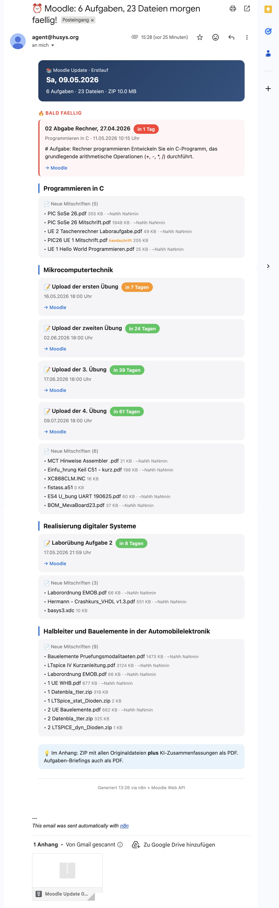

# Moodle AI Briefing Bot

> Automated Moodle scraper that downloads new course materials and generates AI-powered summaries — delivered as a single digest email. Built as an n8n workflow using the Anthropic Claude API.

   

## What it does

Every Monday, Wednesday, and Friday at 13:00 Berlin time, the workflow runs automatically and:

1. **Logs into Moodle** via the official Web Service API (no HTML scraping)
2. **Scans every enrolled course** for new materials and open assignments
3. **Downloads new files** that haven't been seen on previous runs
4. **Analyzes each PDF** with Claude (Haiku for short, Sonnet for long) to:
   - Generate a concise summary
   - Detect handwritten content (skipped — no point summarizing scribbles)
   - Suggest a cleaner filename
5. **Writes assignment briefings** as styled PDFs (what to do, suggested approach, key concepts, time estimate)
6. **Bundles everything in a Gmail-safe ZIP** (DEFLATE compressed, 12 MB cap)
7. **Sends one digest email** with urgency badges, course-grouped sections, and the ZIP attached

## Email preview



The email is HTML-formatted with course-grouped sections, a "Due Soon" highlight at the top with red urgency markers, deadline countdowns, and reading-time estimates. The subject line itself reflects urgency — `🔥 HEUTE faellig!`, `⚠️ in 2 Tagen faellig`.

## Architecture

```
Schedule Trigger (every 1h)
        │
        ▼
Moodle Bot Logic  (Code Node, ~1080 lines)
  ├─ Custom schedule filter (workaround for unreliable n8n Cron)
  ├─ Moodle Web Service API client
  ├─ Anthropic Claude API client (Haiku + Sonnet, with prompt caching)
  ├─ Native PDF generator (Helvetica, multi-page, no external libs)
  ├─ Native ZIP builder (DEFLATE compression)
  └─ HTML email composer
        │
        ▼
IF (skipped by schedule filter?)
        │
        ▼
Send Email  (SMTP with ZIP attached)
```

## Tech stack

- **n8n** — workflow orchestration
- **Anthropic Claude API** — `claude-haiku-4-5` for short PDFs and assignment hints, `claude-sonnet-4-6` for long-form summaries and assignment briefings
- **Moodle Web Service API** — `core_enrol_get_users_courses`, `mod_assign_get_assignments`, `core_course_get_contents`, `core_completion_get_activities_completion_status`
- **JavaScript (Node.js)** — a single Code Node runs the whole pipeline
- **SMTP** — delivery (Gmail App Password works fine)

No external npm packages, no database. The Code Node uses only `Buffer`, `zlib` (built-in Node), and n8n's `helpers.httpRequest`.

## Design decisions worth highlighting

**Adaptive summary depth.** A 5-page worksheet doesn't need a 20-page summary, and a 137-page lecture script does. The bot estimates page count and routes to Haiku (cheap, short output) for ≤10 pages and to Sonnet with up to 14k `max_tokens` for 100+ pages.

**Single-call analysis.** Filename suggestion + handwriting detection + content summary happen in **one** Claude call per PDF, returning structured JSON. Cuts API cost and latency by roughly 3× compared to three separate calls.

**Native PDF & ZIP without dependencies.** The Code Node generates A4 PDFs (Helvetica, multi-page, primary-color styling) and builds DEFLATE-compressed ZIPs from scratch using only Node's built-ins. Keeps the workflow portable to any n8n instance without `npm install` steps.

**Schedule filter workaround.** n8n's native Cron trigger turned out unreliable on the host server, so the workflow runs on a 1-hour interval and an in-code filter (weekday + hour window + "already ran today" check, persisted in `staticData`) decides whether to actually execute.

**Assignment cache.** Open assignments are shown in every digest (not just new ones), with their full briefing cached after first generation. Prevents re-paying for the same Sonnet briefing every two days.

**Gmail-safe ZIP size.** 12 MB hard cap accounts for the ~33% inflation from base64 attachment encoding and stays under Gmail's 25 MB limit. 2 MB are reserved for assignment briefings so they don't get pushed out by large lecture PDFs.

**Cost tracking.** Estimated USD cost is logged per run via a token-based heuristic.

## Setup

### Prerequisites

- An n8n instance (self-hosted or n8n.cloud)
- A Moodle instance with the **Mobile Web Service** enabled (default since Moodle 3.5)
- A Moodle account with username/password authentication (institutions using SSO-only may need to generate a Mobile token manually via Profile → Security → Manage tokens)
- An Anthropic API key — get one at [console.anthropic.com](https://console.anthropic.com)
- An SMTP account for sending email (Gmail App Password works fine)

### Quick start

1. **Import the workflow.** In n8n → Workflows → Import from File → select `moodle-bot-workflow.json`
2. **Configure SMTP credentials.** Open the **Send Email** node, attach your SMTP credential, and replace the placeholder `from` and `to` email addresses
3. **Configure the Code Node.** Open **Moodle Bot Logic** and fill the placeholders at the top:
   ```js
   const CONFIG = {
     MOODLE_USERNAME:    'your_moodle_login',
     MOODLE_PASSWORD:    'your_moodle_password',
     ANTHROPIC_API_KEY:  'sk-ant-api03-...',
     // ...
   };

   const BASE_URL = 'https://moodle.your-school.edu';
   ```
4. **Test once.** Set `TEST_MODE = true` at the top of the Code Node, click **Execute Workflow**, and verify the digest email arrives.
5. **Activate.** Set `TEST_MODE = false`, toggle the workflow to **Active**. The Schedule Trigger will fire hourly; the in-code filter will only let it run on Mon/Wed/Fri at 13:00 Berlin time.

### Configuration reference

| Setting | Default | What it does |
|---|---|---|
| `TEST_MODE` | `false` | When `true`, bypasses the schedule filter — runs immediately on Execute |
| `SCHEDULE.weekdays` | `[1, 3, 5]` | Days of week to run (Mon/Wed/Fri) |
| `SCHEDULE.hour` | `13` | Target hour (Berlin time) |
| `ZIP_MAX_MB` | `12` | Maximum attachment size (Gmail limit is 25 MB after base64 encoding) |
| `HIDE_OVERDUE` | `true` | Skip assignments past their deadline |
| `HIDE_COMPLETED` | `true` | Skip courses/assignments marked complete in Moodle |
| `RENAME_FILES` | `true` | Use Claude to suggest cleaner filenames |
| `MODEL_LIGHT` | `claude-haiku-4-5-20251001` | For short PDFs and assignment hints |
| `MODEL_SUMMARY` | `claude-sonnet-4-6` | For long PDFs and full briefings |

## Compatibility

**Designed for any Moodle 3.5+ instance** with the Mobile Web Service enabled (default in modern installations). The bot uses only standard Moodle API endpoints, so it works against any institution's Moodle, not just one specific deployment.

**Caveats:**
- Institutions requiring SSO-only login (Shibboleth / SAML) may need to generate a Moodle Mobile token manually — the bot then uses that token directly in place of username/password
- AI prompts are written in German; translate them in the Code Node if your courses are in another language
- The schedule filter is set to Berlin time — change `Europe/Berlin` to your time zone if needed

## Files

- [`moodle-bot.js`](moodle-bot.js) — the Code Node logic, standalone for readability
- [`moodle-bot-workflow.json`](moodle-bot-workflow.json) — the complete n8n workflow, ready to import

## License

MIT — see [LICENSE](LICENSE)

---

Built by [Johannes Uth](https://github.com/johannesuth) · Issues and feedback welcome via [GitHub Issues](https://github.com/johannesuth/moodle-ai-briefing-bot/issues)
